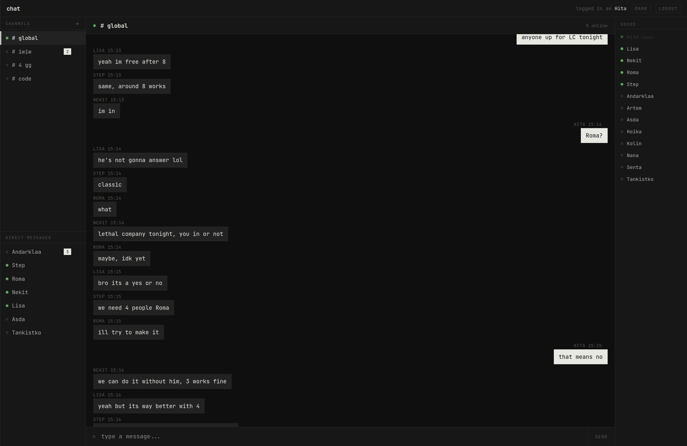
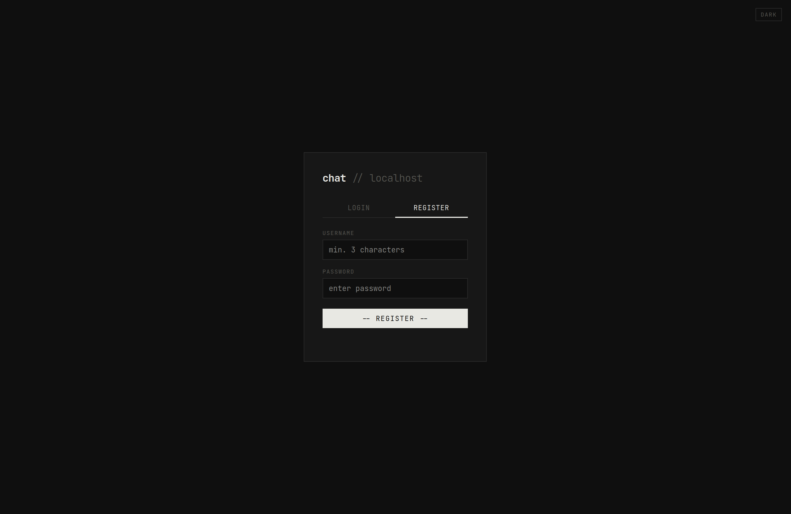

# chat-app

Real-time chat running in the browser. Terminal-inspired UI, no external services — just a Python process and a SQLite file.

## Screenshots





## Stack

- **Frontend** — React 18, TypeScript, Vite
- **Backend** — Python 3.12, asyncio, websockets
- **Database** — SQLite (WAL mode)
- **Auth** — bcrypt password hashing

## Project layout

```
chat-app/
├── server.py          # WebSocket + static file server
├── requirements.txt
├── .env.example
├── index.html
├── vite.config.ts
├── tsconfig.json
├── package.json
└── src/
    ├── main.tsx
    ├── App.tsx            # root component, state, WS logic
    ├── index.css
    ├── types/
    │   └── index.ts
    ├── hooks/
    │   └── useWebSocket.ts
    └── components/
        ├── AuthScreen.tsx
        ├── Sidebar.tsx
        ├── ChatPane.tsx
        └── UsersPanel.tsx
```

## Getting started

### Backend

```bash
python -m venv .venv
source .venv/bin/activate   # Windows: .venv\Scripts\activate
pip install -r requirements.txt

cp .env.example .env        # adjust ports if needed
python server.py
```

### Frontend

```bash
npm install
npm run dev     # dev server on :5173, proxies WS to :8765
npm run build   # production build -> dist/
```

In production the server serves `dist/` directly over HTTP and listens for WebSocket connections on a separate port. No nginx required for local use.

## Configuration

Copy `.env.example` to `.env`. Available variables:

| Variable              | Default     | Description                          |
|-----------------------|-------------|--------------------------------------|
| `HTTP_HOST`           | `127.0.0.1` | HTTP bind address                    |
| `HTTP_PORT`           | `8080`      | HTTP port (serves dist/)             |
| `WS_HOST`             | `127.0.0.1` | WebSocket bind address               |
| `WS_PORT`             | `8765`      | WebSocket port                       |
| `DB_FILE`             | `chat.db`   | SQLite database path                 |
| `STATIC_DIR`          | `dist`      | Path to built frontend               |
| `GLOBAL_HIST`         | `200`       | Messages loaded on connect           |
| `MAX_MSG_LEN`         | `4000`      | Max message length in characters     |
| `BCRYPT_ROUNDS`       | `12`        | bcrypt work factor                   |
| `RATE_LIMIT_ATTEMPTS` | `10`        | Max auth attempts per IP per window  |
| `RATE_LIMIT_WINDOW`   | `60`        | Rate limit window in seconds         |
| `LOG_LEVEL`           | `INFO`      | DEBUG / INFO / WARNING / ERROR       |

## WebSocket protocol

Messages are JSON objects with a `type` field.

**Client to server**

| type             | Fields                  |
|------------------|-------------------------|
| `register`       | `username`, `password`  |
| `login`          | `username`, `password`  |
| `message`        | `to`, `content`         |
| `get_history`    | `with`                  |
| `create_channel` | `name`, `members[]`     |
| `delete_channel` | `channel_id`            |
| `close_dm`       | `peer`                  |
| `delete_message` | `msg_id`                |

**Server to client**

| type              | Fields                                |
|-------------------|---------------------------------------|
| `auth_ok`         | `username`                            |
| `auth_error`      | `msg`                                 |
| `user_list`       | `users[]`, `online[]`                 |
| `contacts`        | `contacts[]`                          |
| `channels`        | `channels[]`                          |
| `message`         | `id`, `from`, `to`, `content`, `ts`   |
| `history`         | `channel`, `messages[]`               |
| `message_deleted` | `msg_id`, `channel`                   |
| `channel_created` | `channel`                             |
| `channel_deleted` | `channel_id`                          |

## Docker

```bash
npm run build
docker compose up --build
```

App will be available at `http://localhost:8080`.

## License

MIT
